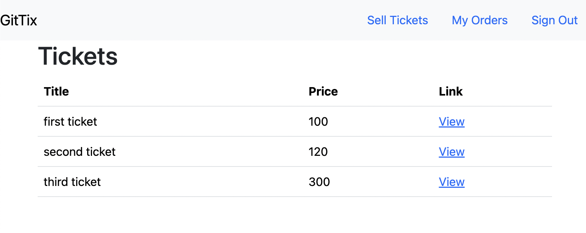
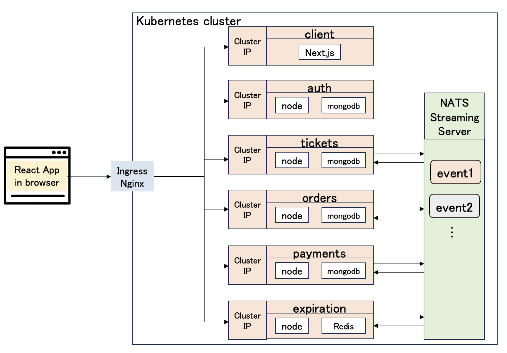

# Blog Application Overview
## Ticketing E-commerce Application

### Description
This ticketing e-commerce application has been developed for educational purposes, showcasing various functionalities related to ticket management and sales. The main features include:

- Creating, editing, and deleting tickets
- Ordering tickets
- Purchasing tickets



### App Overview
The ticketing application follows a microservices architecture, comprising six independent services: Auth, Client, Tickets, Orders, Payments, and Expiration. These services operate concurrently and are deployed within a Kubernetes cluster. Load balancing of external traffic to each service is managed by an ingress controller.

Due to the microservices design, direct communication between services is avoided. Instead, events are generated whenever a service executes a task. These events are then transmitted to the NATS-Streaming Server, serving as the Event Bus. Subsequently, the Pub-Sub model is employed to relay these events to the relevant services.



This architecture promotes scalability, maintainability, and independence of each service. The use of an Event Bus enhances decoupling between services, enabling efficient communication in a distributed environment.

This ticketing e-commerce application serves as a practical example of microservices implementation, providing insights into the orchestration and communication strategies within a complex system.


# Prerequisites
 Make sure you have Node.js, Docker, Skaffold, kubectl, and Ingress-Nginx installed. 
 Make sure you have Node.js, Docker, Skaffold, kubectl, and Ingress-Nginx installed. 

## Setting up Authentication Microservice
```
cd auth
npm install
sed -i 's|image: .*|image: {your_docker_id}/auth|' k8s/deployment.yaml
cd ..
skaffold dev
kubectl apply -f https://raw.githubusercontent.com/kubernetes/ingress-nginx/controller-v1.8.2/deploy/static/provider/cloud/deploy.yaml
npm run test
```

## If running locally
```
docker build -t YOURDOCKERID/auth .
docker push YOURDOCKERID/auth
```
## Setting up Client Microservice
```
cd client
docker build -t YOURDOCKERID/client .
docker push YOURDOCKERID/client
cd ..
skaffold dev
```
## Setting up Other Microservices
Repeat above steps for other microservices like /tickets and /nets-test.

## Running NATS Server
```
NATS_POD=$(kubectl get pods -l app=nats-depl -o jsonpath='{.items[0].metadata.name}')
kubectl port-forward $NATS_POD 4222:4222 &
kubectl port-forward $NATS_POD 8222:8222 &
```
## Run NATS Server commands
```
cd nats-test
npm run publish
npm run listen
npm run listen
```
