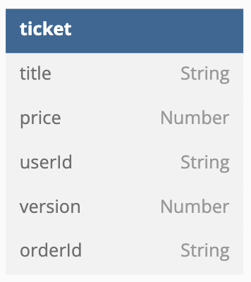
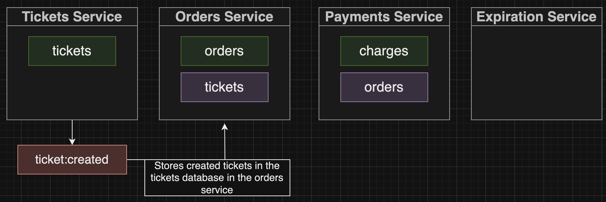
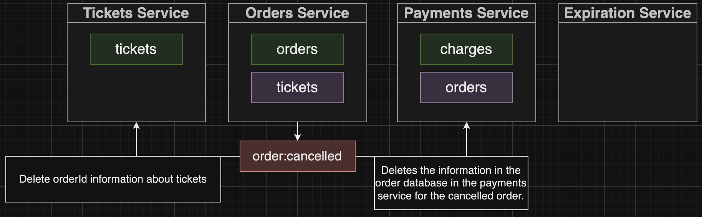
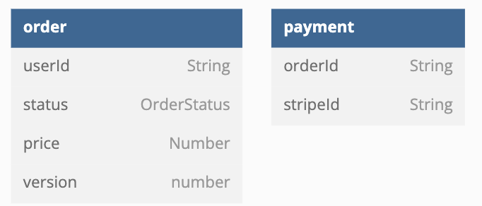

# Ticketing App
## Overview
これは学習目的で開発したシンプルなチケティングEコマースアプリケーションです。以下の機能をサポートしています。
- チケットの作成、編集、削除
- チケットの注文
- チケットの購入
<p align="center">
  
</p>

## App Architecture Overview
このチケットアプリは、バックグラウンドで実行される6つの小規模な独立したサービスから構成されるマイクロサービスアプリケーションです。
Auth、Client、Tickets、Orders、Payments、Expirationの6つのサービスがあります。
これらはKubernetesクラスタにデプロイされ、外部から各サービスへのトラフィックのロードバランシングはIngressコントローラによって処理されます。
アプリはマイクロサービスアーキテクチャに従っているため、これらのサービスは直接通信しません。
代わりに、各サービスがタスクを実行するたびに発行されるイベントはNATS Streaming Serverに送信され、それをEvent Busとして使用してPub-Subモデルを使用して適切なサービスに送信されます。
<p align="center">
  
</p>

## Client Service

### Overview
クライアントサービスはReactアプリを提供し、ユーザーアクションに基づいて他のサービスと通信します。
たとえば、ユーザーがチケットの作成にタイトルと価格を入力して「送信」ボタンをクリックすると、HTTP POSTリクエストがチケットサービスに送信されます。

## Auth Service

### overview
認証サービスはユーザー認証に関連する機能を提供します。
主な機能は、サインアップ（ユーザー登録）、サインイン、サインアウト、および現在のユーザー情報の取得です。
サインアップ時には、ユーザー情報がデータベースに登録され、セッション管理のためにサーバーサイドでJWTが生成されます。
また、JWTを使用して認証されたユーザー情報をリクエストオブジェクトに追加するミドルウェアもあり、ユーザーが一度ログインすれば再びサインインする必要はありません。

### Root
<p align="center">
  
</p>

### Data Model
<p align="center">
  
</p>

## Ticket Service

### Overview
チケットサービスは、チケットの作成、取得、更新の機能を提供し、NATS Streamingサーバーを介してイベントを発行します。
また、作成または更新されたすべてのチケットを保存するために独自のMongoDBデータベースを維持しています。

### Root
<p align="center">
  
</p>

### Data Model
<p align="center">
  
</p>

### Event
このサービスのイベントには次のタイプがあり、以下の図に示すように他のサービスに発行されます。
### ticket:created
<p align="center">
  
</p>

### ticket:updated
<p align="center">
  
</p>

## Order Service

### Overview
注文サービスは、チケットのための注文の作成、取得、削除の機能を提供し、NATS Streamingサーバーを介してイベントを発行します。
また、作成または更新されたすべてのチケットを保存するために独自のMongoDBデータベースを維持しています。

### Root
<p align="center">
  
</p>

### Data Model
<p align="center">
  
</p>

### Event
このサービスのイベントには次のタイプがあり、以下の図に示すように他のサービスに発行されます。
### order:created
<p align="center">
  
</p>

### order:cancelled
<p align="center">
  
</p>

## Payment Service

### Overview
支払いサービスは、ユーザーが注文に対して支払いを行う機能を提供し、Stripeを使用して支払いを処理し、
データベースに支払い情報を記録し、NATS Streamingサーバーを介してイベントを発行します。

### Root
<p align="center">
  
</p>

### Data
<p align="center">
  
</p>

### Event
このサービスのイベントには次のタイプがあり、以下の図に示すように他のサービスに発行されます。
### payment:created
<p align="center">
  
</p>

## Expiration Service

### Overview
有効期限サービスは、注文が作成されたときの注文の有効期限を管理し、有効期限が切れると注文ステータスの更新を行うジョブをキューにスケジュールします。

### Event
このサービスのイベントには次のタイプがあり、以下の図に示すように他のサービスに発行されます。
### expiration:complete
<p align="center">
  
</p>

## マイクロサービスのセットアップ手順
まず、必要なものはNode.js、Docker、Skaffold、kubectl、そしてIngress-Nginxがインストールされていることを確認してください。

### 認証マイクロサービスのセットアップ
   ```bash
   cd auth
   npm install
   sed -i 's|image: .*|image: {your_docker_id}/auth|' k8s/deployment.yaml
   cd ..
   skaffold dev
   kubectl apply -f https://raw.githubusercontent.com/kubernetes/ingress-nginx/controller-v1.8.2/deploy/static/provider/cloud/deploy.yaml
   npm run test
   ```

### ローカルで実行する場合
   ```bash
   docker build -t YOURDOCKERID/auth .
   docker push YOURDOCKERID/auth
   ```

次に、クライアントマイクロサービスのセットアップ手順です。

### クライアントマイクロサービスのセットアップ
   ```bash
   cd client
   docker build -t YOURDOCKERID/client .
   docker push YOURDOCKERID/client
   cd ..
   skaffold dev
   ```

その他のマイクロサービス（例：/ticketsや/nets-test）についても、上記の手順を繰り返してセットアップします。

NATSサーバーを実行する手順は次の通りです。

### NATSサーバーの実行
   ```bash
   NATS_POD=$(kubectl get pods -l app=nats-depl -o jsonpath='{.items[0].metadata.name}')
   kubectl port-forward $NATS_POD 4222:4222 &
   kubectl port-forward $NATS_POD 8222:8222 &
   ```

NATSサーバーコマンドを実行する手順は次の通りです。

### NATSサーバーコマンドの実行
   ```bash
   cd nats-test
   npm run publish
   npm run listen
   npm run listen
   ```

これで、認証マイクロサービス、クライアントマイクロサービス、およびその他のマイクロサービスがセットアップされ、NATSサーバーが実行されている状態になります。